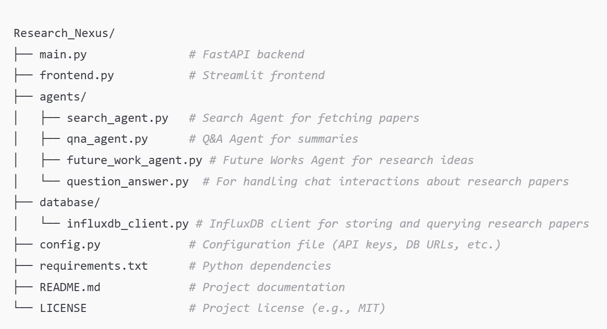

# Research Nexus (Attention.AI)

**Research Nexus** is an AI-powered academic research assistant application that utilizes Large Language Models (LLMs) through the Google Gemini API to assist researchers in searching, summarizing, and analyzing research papers. Built with an intuitive interface and backed by modular agents, **Research Nexus** allows users to efficiently generate summaries, answer questions, and suggest future research directions for a given topic.

## Table of Contents
- [Features](#features)
- [Project Architecture](#project-architecture)
- [Technologies Used](#technologies-used)
- [Installation](#installation)
- [Usage](#usage)
- [Future Enhancements](#future-enhancements)
- [Contributing](#contributing)
- [License](#license)

---

## Features

- **Data Collection**: Search for related research papers on a specific topic using the CrossRef API and store them in a time-series database.
- **Summarization**: Summarize recent research contributions and generate new research ideas based on advancements from the past five years.
- **Question Answering**: Respond to specific user queries about stored research papers, including questions on visual data like images and charts.
- **Review Paper Generation**: Automatically compile a review paper summarizing key research points and suggesting future research directions.
- **Interactive Chat Interface**: Users can interact with the assistant through a friendly chat-based interface.

## Project Architecture

Research Nexus follows a modular architecture using multi-agent capabilities:

1. **Search Agent**: Searches for relevant research papers using the **CrossRef API** based on user-specified topics. This enables automatic fetching of metadata for academic research papers.
   
2. **Database Agent**: Queries stored research data in a time-series format for specific topics and years using **InfluxDB**.
   
3. **Q&A Agent**: Answers user questions related to specific papers, including visual elements such as charts and images.

4. **Future Works Agent**: Generates ideas and creates a summary with future research directions.



## Technologies Used

- **Frameworks**: Streamlit (Frontend), FastAPI (Backend)
- **Large Language Models**: Google Gemini API (for LLM tasks)
- **Database**: InfluxDB for storing time-series data
- **API Interaction**: FastAPI for seamless microservices communication
- **Research Paper Search**: CrossRef API for searching academic papers based on a given topic

## CrossRef API for Paper Search

The **CrossRef API** is used in this project to search for academic papers by topic. The `Search Agent` uses this API to fetch relevant research papers and their metadata, such as titles, abstracts, and publication years. Here's an example query format:

```python
url = f"https://api.crossref.org/works?query={topic}&rows=50"
```

This query will retrieve up to 50 papers related to the specified `topic`. The CrossRef API is ideal for gathering academic articles and their metadata for the research assistant's database.

## Installation

1. **Clone the Repository**:
   ```bash
   git clone https://github.com/Ravii-saini/Research_Nexus.git
   cd Research_Nexus
   ```

2. **Install Dependencies**:
   Make sure to have Python installed. Then, install required libraries:
   ```bash
   pip install -r requirements.txt
   ```

3. **Set Up Database**:
   - Install and configure **InfluxDB** for time-series data storage.

4. **Environment Configuration**:
   Update the `config.py` file with your **Google Gemini API** keys and **InfluxDB** credentials.

## Usage

1. **Start the Backend (FastAPI)**:
   ```bash
   uvicorn main:app --reload
   ```

2. **Launch the Frontend (Streamlit)**:
   ```bash
   streamlit run frontend.py
   ```

3. **Interact with Research Nexus**:
   - Open `http://localhost:8501` in your browser.
   - Enter a research topic to search for papers, view summaries, ask questions, and explore future research directions.

## Future Enhancements

- **Enhanced Summarization**: Add support for more detailed and structured summaries.
- **Improved Q&A Functionality**: Enable image, chart, and graph recognition in answers.
- **Integration with More Databases**: Expand to support additional data storage and retrieval options for larger research collections.

## Contributing

Contributions are welcome! Please fork the repository, make your changes, and submit a pull request.

1. Fork the Project
2. Create your Feature Branch (`git checkout -b feature/NewFeature`)
3. Commit your Changes (`git commit -m 'Add new feature'`)
4. Push to the Branch (`git push origin feature/NewFeature`)
5. Open a Pull Request

## License

Distributed under the MIT License. See `LICENSE` for more information.

---

Thank you for using **Research Nexus**! Let’s redefine academic research together.

